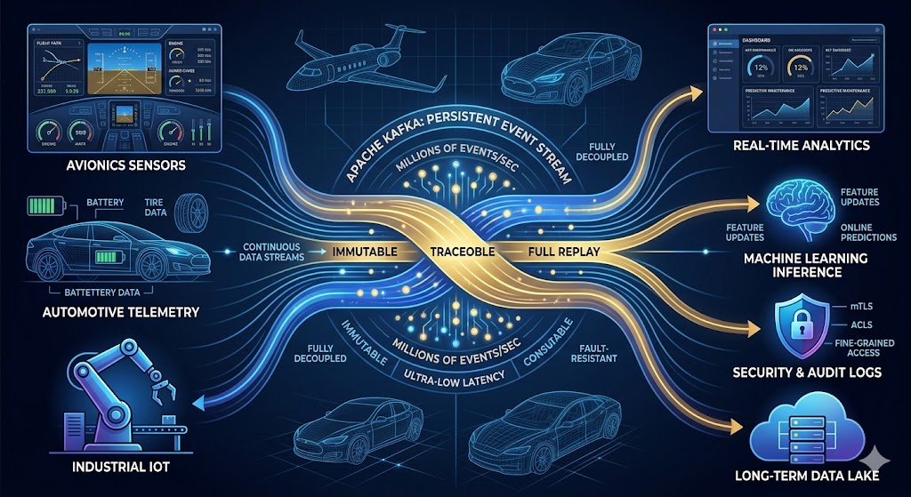

# [Scenario 06] Apache Kafka as a Critical Infrastructure: Security, Resilience, and Data Traceability
Many modern systems (avionics, automotive, industrial) are becoming increasingly data-driven, yet one fundamental architectural choice is still often underestimated: **the data transport layer**.

Apache Kafka is still ignored in many architectures today because it is perceived as *"just a messaging system"*, rather than a critical infrastructure component for security and reliability. In reality, Kafka is not only a streaming tool, but a backbone for highly critical distributed systems, with characteristics that make it suitable for environments where data is sensitive and continuous:

* **Persistence and traceability:** It guarantees the immutability of the event log (*immutable event log*).
* **Replay and Auditing:** It enables full replay and retroactive auditing of data flows.
* **Extreme scalability:** It supports handling millions of events per second.
* **Decoupling:** It completely separates producer (*producers*) and consumer (*consumers*) systems.
* **Enterprise-grade Security:** It natively integrates advanced security protocols like TLS/mTLS, ACLs, and fine-grained access control.
* **Real-time distribution:** It enables real-time data distribution to multiple systems without duplicating data transmission streams.

---

## Architectural Value: Beyond Simple Encryption

An often overlooked point is this: **security is not only about encrypting data, but about correctly designing its transport and distribution layer.**

In many cases, custom pipelines, synchronous REST APIs, or ad-hoc solutions are still chosen, ignoring that systems like Kafka are already designed to offer:
1. **Fault resilience**
2. **Domain isolation**
3. **Continuous critical data streams**
4. **Secure integration in enterprise environments**

In domains such as automotive and avionics, where data is continuous, distributed, and sensitive, this choice can make the difference between a fragile system and a truly scalable and secure one.

---

## Deployment Models and Supported Services

The main services supporting Kafka in the current market can be divided into three macro-categories:

### 1. Fully Managed Native Kafka Services
This represents the "classic" model offered by major cloud providers and specialized vendors. The main ones include:
* **Amazon MSK** (Managed Streaming for Apache Kafka)
* **Confluent Cloud**
* **Aiven for Apache Kafka**
* **Google Cloud Managed Service for Apache Kafka**
* **Instaclustr for Apache Kafka**

In this scenario, the platform is "real" Kafka, but the entire cluster lifecycle — including scalability, high availability, and maintenance — is fully managed and delegated to the provider.

### 2. Kafka-Compatible or Streaming Platforms
These are streaming solutions that do not use native Kafka under the hood, but they expose compatible APIs or adopt very similar ingestion models. In these cases as well, infrastructure management is fully handled by the provider:
* **Azure Event Hubs** (with Apache Kafka ecosystem enabled)
* **Redpanda Cloud**

### 3. Self-Managed Model
In this approach, the company installs and operates Kafka directly on its own infrastructure or on cloud virtual machines (e.g., EC2 instances or Compute Engine).
* **Responsibility:** The entire cluster lifecycle (installation, security configuration, scaling, and routine/extraordinary maintenance) is the sole responsibility of the internal engineering team.

---

## Scientific Evidence and Limits of Application

Recent scientific literature and technical documentation describe Kafka as a core event-streaming substrate for moving continuous data reliably, at scale, and with complete operational traceability. Sector reports highlight real-time pipelines with high throughput and minimal latency, built on a distributed, fault-tolerant model that preserves consistency even under node failure.

The platform’s security model is likewise infrastructure-grade rather than ad hoc: official documentation shows native SSL/TLS-based encryption and authentication, together with ACL-based access control that defaults to restrictive behavior when no rule is defined.

### Support for Artificial Intelligence (AI)
Comparative studies indicate that Kafka-based centralized platforms can support independent consumption by multiple downstream applications, serving as the basis for:
* Online machine learning inference.
* Adaptive resource management.
* Cross-datacenter replication.

Specifically, research reports zero data loss (*zero data loss*) and a throughput up to **ten times higher** than a synchronous REST-based design. This explains Kafka’s central role in AI services, where training feeds, feature updates, inference events, and telemetry need to move continuously between producers, stream processors, and model-serving layers.

### The Avionics Context: Near Real-Time vs Hard Real-Time
While evidence supports Kafka as a robust data-plane component for telemetry, diagnostics, and maintenance synchronization in civil avionics, **it does not prove hard real-time determinism**.

The current sources do not establish bounded worst-case latency, low jitter, or certification-grade timing guarantees. Therefore, Kafka fits near-real-time functions perfectly, but it is not suitable for time-critical control loops where deterministic behavior must be demonstrated end-to-end.

---

## Bibliographical and Documental References

* **Stream Processing with Apache Kafka: Real-Time Data Pipelines** [ijrmeet.org/stream-processing-with-apache-kafka-real-time-data-pipelines](https://ijrmeet.org/stream-processing-with-apache-kafka-real-time-data-pipelines/)
* **Encryption and Authentication using SSL** [kafka.apache.org/43/security/encryption-and-authentication-using-ssl](https://kafka.apache.org/43/security/encryption-and-authentication-using-ssl/)
* **Kafka-Driven Scalable Streaming Pipelines for Real-Time Sensor Ingestion and High-Throughput Data Lakehouse Architecture** [jisem-journal.com/index.php/journal/article/view/14241](https://www.jisem-journal.com/index.php/journal/article/view/14241)
* **Reliability enhancements for high-availability systems using distributed event streaming platforms** [ieeexplore.ieee.org/document/10430800](https://ieeexplore.ieee.org/document/10430800)

---

> The real question is no longer "can we use Kafka?", but rather:  
> **"Can we afford not to use it when the system becomes critical?"**
