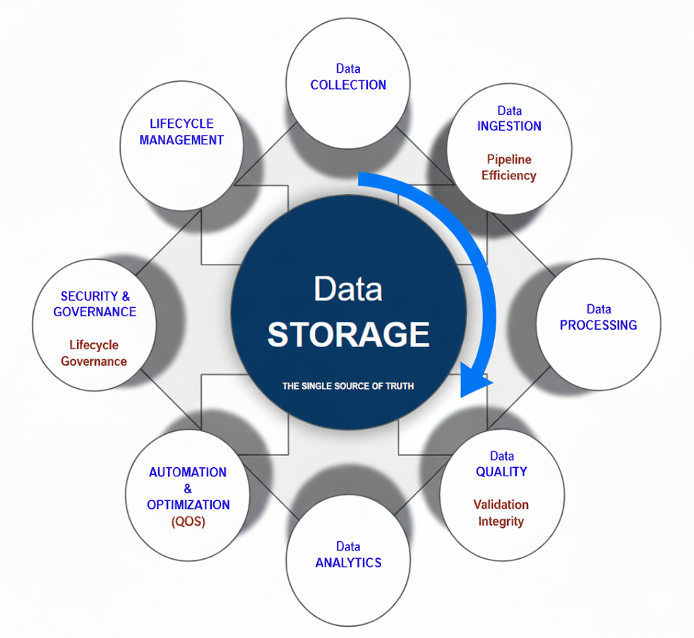

# Posts: Data Engineering Studies
> **Study over data engineering topics.**

This repository documents my journey in Data Engineering, bridging the gap between Edge Computing and Cloud ecosystems.

---

### The Framework

### Data Engineering Framework with 9 Key Components

| **Diagram Point**      | **Associated Tech Pillar**         | **Technical Role (AWS/GCP)**                      |
| :------------------------- | :------------------------------------- | :---------------------------------------------------- |
| **🏗️ Data STORAGE**        | **🌐 Object Storage / Warehouse**      | The core: S3/GCS and Redshift/BigQuery              |
| **📦 Data COLLECTION**     | **📊 Streaming Ingestion**            | Data capture (MSK / Pub/Sub)                         |
| **🔄 Data INGESTION**      | **☁️ Serverless ETL**                | Initial loading (Glue / Dataflow)                   |
| **⚙️ Data PROCESSING**     | **🐘 Big Data Processing**            | Heavy transformations (Spark / EMR)                  |
| **✅ Data QUALITY**         | **🔍 Serverless Compute**              | Code-based validation (Lambda / Functions)           |
| **📈 Data ANALYTICS**      | **🏢 Data Warehouse (Analysis)**       | SQL queries for business insights                    |
| **⚙️ AUTOMATION & OPTIMIZATION** | **🌪️ Managed Airflow**           | The orchestrator of data workflows              |
| **🔒 SECURITY & GOVERNANCE**  | **🛠️ Infrastructure as Code**      | Terraform for permissions and policies (IAM)         |
| **🗂️ LIFECYCLE MANAGEMENT**  | **🎭 Workflow Orchestration**       | Coordinates automated tasks (Step Functions)                 |

This core structure facilitates a clear separation of concerns between raw signals and structured business 
intelligence, ensuring consistency, scalability, and optimization.

---

## 🎯 Objectives & Index

* **Architectural Schematics:** High-level system design.
* **Technical Notes:** Implementation details.

**📂 Content Index**
1. **[Scenario 01]** From Edge to Data Engineering
2. **[Scenario 02]** Payload Optimization (Bandwidth)
3. **[Scenario 03]** Data Governance (TinyML MLOps)

---
